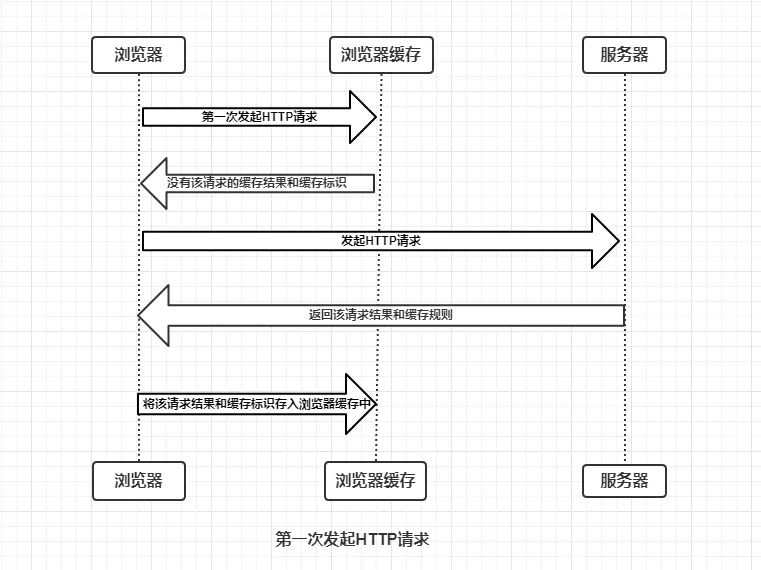
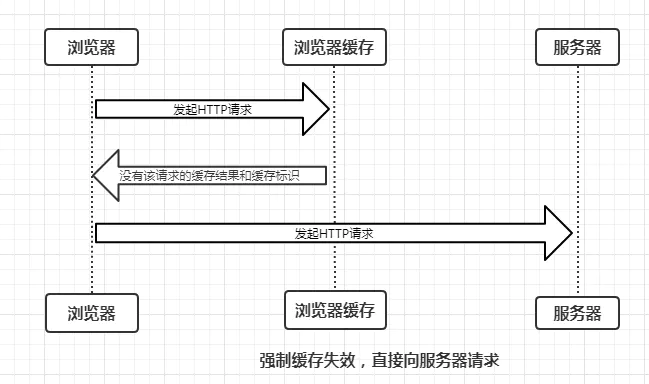
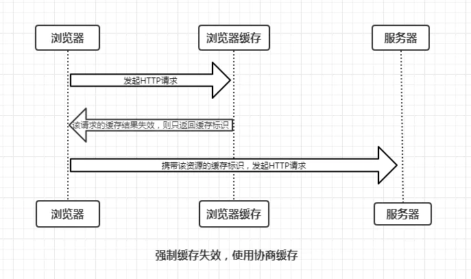
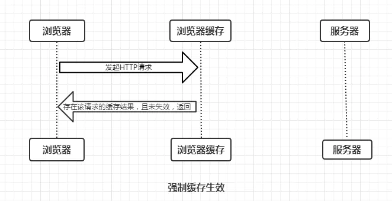

### 概述
浏览器的缓存机制也就是我们说的HTTP缓存机制，其机制是根据HTTP报文的缓存标识进行的，所以在分析浏览器缓存机制之前，我们先使用图文简单介绍一下HTTP报文，HTTP报文分为两种：
HTTP请求(Request)报文，报文格式为：请求行 – HTTP头(通用信息头，请求头，实体头) – 请求报文主体(只有POST才有报文主体)，如下图

缓存过程分析
    浏览器与服务器通信的方式为应答模式，即是：浏览器发起HTTP请求 – 服务器响应该请求。那么浏览器第一次向服务器发起该请求后拿到请求结果，会根据响应报文中HTTP头的缓存标识，决定是否缓存结果，是则将请求结果和缓存标识存入浏览器缓存中，简单的过程如下图：

由上图我们可以知道：
浏览器每次发起请求，都会先在浏览器缓存中查找该请求的结果以及缓存标识
浏览器每次拿到返回的请求结果都会将该结果和缓存标识存入浏览器缓存中 
以上两点结论就是浏览器缓存机制的关键，他确保了每个请求的缓存存入与读取，只要我们再理解浏览器缓存的使用规则，那么所有的问题就迎刃而解了，本文也将围绕着这点进行详细分析。为了方便大家理解，这里我们根据是否需要向服务器重新发起HTTP请求将缓存过程分为两个部分，分别是强制缓存和协商缓存。
强制缓存
强制缓存就是向浏览器缓存查找该请求结果，并根据该结果的缓存规则来决定是否使用该缓存结果的过程，强制缓存的情况主要有三种(暂不分析协商缓存过程)，如下：
不存在该缓存结果和缓存标识，强制缓存失效，则直接向服务器发起请求（跟第一次发起请求一致），如下图：

存在该缓存结果和缓存标识，但该结果已失效，强制缓存失效，则使用协商缓存(暂不分析)，如下图

存在该缓存结果和缓存标识，且该结果尚未失效，强制缓存生效，直接返回该结果，如下图

    那么强制缓存的缓存规则是什么？

当浏览器向服务器发起请求时，服务器会将缓存规则放入HTTP响应报文的HTTP头中和请求结果一起返回给浏览器，控制强制缓存的字段分别是Expires和Cache-Control，其中Cache-Control优先级比Expires高。
Expires
Expires是HTTP/1.0控制网页缓存的字段，其值为服务器返回该请求结果缓存的到期时间，即再次发起该请求时，如果客户端的时间小于Expires的值时，直接使用缓存结果。

    Expires是HTTP/1.0的字段，但是现在浏览器默认使用的是HTTP/1.1，
    那么在HTTP/1.1中网页缓存还是否由Expires控制？

到了HTTP/1.1，Expire已经被Cache-Control替代，原因在于Expires控制缓存的原理是使用客户端的时间与服务端返回的时间做对比，那么如果客户端与服务端的时间因为某些原因（例如时区不同；客户端和服务端有一方的时间不准确）发生误差，那么强制缓存则会直接失效，这样的话强制缓存的存在则毫无意义，那么Cache-Control又是如何控制的呢？
Cache-Control
在HTTP/1.1中，Cache-Control是最重要的规则，主要用于控制网页缓存，主要取值为：

    
    public：所有内容都将被缓存（客户端和代理服务器都可缓存）
    private：所有内容只有客户端可以缓存，Cache-Control的默认取值
    no-cache：客户端缓存内容，但是是否使用缓存则需要经过协商缓存来验证决定
    no-store：所有内容都不会被缓存，即不使用强制缓存，也不使用协商缓存
    max-age=xxx (xxx is numeric)：缓存内容将在xxx秒后失效
    
协商缓存
    协商缓存就是强制缓存失效后，浏览器携带缓存标识向服务器发起请求，由服务器根据缓存标识决定是否使用缓存的过程，主要有以下两种情况：
    协商缓存生效，返回304，如下
    
        
            
            
        
        304
    
    协商缓存失效，返回200和请求结果结果，如下
    
        
            
            
        
        200
    
    同样，协商缓存的标识也是在响应报文的HTTP头中和请求结果一起返回给浏览器的，控制协商缓存的字段分别有：Last-Modified / If-Modified-Since和Etag / If-None-Match，其中Etag / If-None-Match的优先级比Last-Modified / If-Modified-Since高。
    Last-Modified / If-Modified-Since
    Last-Modified是服务器响应请求时，返回该资源文件在服务器最后被修改的时间，如下。
    
        
            
            
        
        last-modify
    
    If-Modified-Since则是客户端再次发起该请求时，携带上次请求返回的Last-Modified值，通过此字段值告诉服务器该资源上次请求返回的最后被修改时间。服务器收到该请求，发现请求头含有If-Modified-Since字段，则会根据If-Modified-Since的字段值与该资源在服务器的最后被修改时间做对比，若服务器的资源最后被修改时间大于If-Modified-Since的字段值，则重新返回资源，状态码为200；否则则返回304，代表资源无更新，可继续使用缓存文件，如下。
        
    
        
            
            
        
        If-Modified-Since
    
    Etag / If-None-Match
    Etag是服务器响应请求时，返回当前资源文件的一个唯一标识(由服务器生成)，如下。
    
        
            
            
        
        Etag
    
    If-None-Match是客户端再次发起该请求时，携带上次请求返回的唯一标识Etag值，通过此字段值告诉服务器该资源上次请求返回的唯一标识值。服务器收到该请求后，发现该请求头中含有If-None-Match，则会根据If-None-Match的字段值与该资源在服务器的Etag值做对比，一致则返回304，代表资源无更新，继续使用缓存文件；不一致则重新返回资源文件，状态码为200，如下。
    
        
            
            
        
        Etag-match
    
    注：Etag / If-None-Match优先级高于Last-Modified / If-Modified-Since，同时存在则只有Etag / If-None-Match生效。
    总结
    强制缓存优先于协商缓存进行，若强制缓存(Expires和Cache-Control)生效则直接使用缓存，若不生效则进行协商缓存(Last-Modified / If-Modified-Since和Etag / If-None-Match)，协商缓存由服务器决定是否使用缓存，若协商缓存失效，那么代表该请求的缓存失效，重新获取请求结果，再存入浏览器缓存中；生效则返回304，继续使用缓存，主要过程如下：

来自：https://juejin.cn/post/6844903593275817998

1. 缓存作用

- 减少了冗余的数据传输，节省了王菲

- 减少了服务器的负担，大大提高了网站的性能

- 加快了客户端加载网页的速度

2. 缓存分类

- 强制缓存如果生效，不需要再和服务器发生交互，而协商缓存（对比缓存）不管是否有效，都需要与服务器发生交互

- 两类缓存规则可以同事存在，服务器会将数据和缓存规则一并还回，缓存规则信息包含在响应header中。
