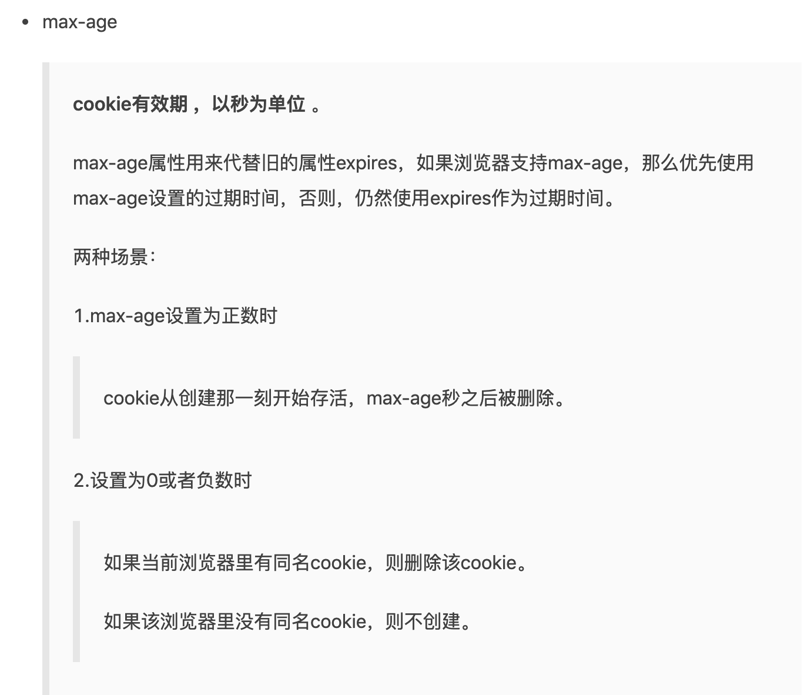

//怎么删除cookie
//只能通过设置cookie的过期时间来删除cookie
//cookie过期时间怎么设置

Chrome下 一个cookie被限制为4095=name+value 一共的字节目前可以设置多个 不知道一个源下最大限度可以一直存 但不知道是否可以请求接口成功
Localstorage 被在chrome和safari下 被限制为2.5MB

Localstorage 保存到用户手动删除或者浏览器清除缓存
sessionstorage保存到会话结束也就是退出浏览器或者浏览器清除缓存
